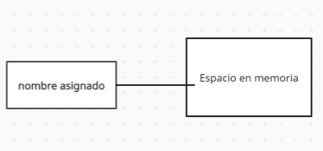

### Variables:


 Una variable en Python es un espacio de memoria que se utiliza para almacenar datos. Los datos pueden ser de diferentes tipos, como números, cadenas de texto, listas, diccionarios, entre otros.





Declarar variables individuales.

```
edad = 25
```

Varias variables.

```
nombre, apellido, apellido = "Luis", "Moralez", 21
print(nombre, apellido, edad)

> "Luis", "Moralez", 21
```

