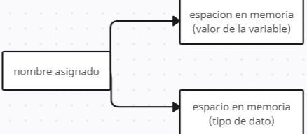

### Variables:

___Las variables en Python son etiquetas que se utilizan para hacer referencia a los datos almacenados en la memoria. Cuando se crea una variable en Python, se le asigna un nombre que se utiliza para referirse al valor almacenado en ella. En lugar de pensar en una variable como un "contenedor" que almacena un valor, es más preciso pensar en ella como una etiqueta que se adhiere a un valor en la memoria.___


___Cada vez que se crea una variable en Python, se asigna un espacio en la memoria para almacenar su valor y su tipo de dato. Es decir, la variable no solo contiene el valor de la información, sino que también tiene una referencia a su tipo de dato.___




___Se puede utilizar el nombre de la variable "edad" en el código para hacer referencia al valor almacenado en ella. Sin embargo, es importante tener en cuenta que, en realidad, lo que se almacena en la variable es una referencia a la ubicación en la memoria donde se encuentra el valor.___

Declarar variables individuales:

```
edad = 25
```

___En este caso, la variable "edad" es un objeto de tipo entero que ocupa un espacio en la memoria. Python utiliza la referencia a este objeto para acceder al valor almacenado y manipularlo si es necesario.___


___La razón por la que se considera que las variables son objetos en Python es porque, al igual que los objetos en la programación orientada a objetos, las variables en Python tienen atributos y métodos que pueden ser utilizados para manipular su valor.___


___Por ejemplo, podemos utilizar el método "upper()" en una variable de tipo cadena para convertir todas las letras en mayúsculas:___

```
nombre = "juan"
nombre_en_mayusculas = nombre.upper()
```

___En este caso, el método "upper()" se está aplicando a la variable "nombre" que es un objeto de tipo cadena y devuelve otra cadena con todas las letras en mayúsculas.___

Varias variables:

```
nombre, apellido, edad = "Luis", "Moralez", 19
print(nombre, apellido, edad)

> "Luis", "Moralez", 19
```

___Las variables en Python son locales por defecto. Esto quiere decir que las variables       definidas y utilizadas en el bloque de código de una función, sólo tienen existencia dentro de la misma, y no interfieren con otras variables del resto del código.___

Constantes:

___En Python, no existe un tipo de dato específico para las constantes, pero convencionalmente se utilizan variables que no se modifican durante la ejecución del programa para representar valores constantes.___

___Una forma común de definir una constante en Python es utilizar una variable en mayúsculas para indicar que su valor no debe ser modificado durante la ejecución del programa.___

```
EDAD = 25
```

___Python define una serie de valores constantes en su propio namespace. Los más importantes son:___

```False```: El valor false del tipo bool.

```True```: El valor true del tipo bool.

```None```: El valor del tipo NoneType. Generalmente None se utiliza para representar la ausencia de valor de una variable.

Variables globales:

___En Python, se pueden declarar variables globales para que estén disponibles en todo el programa. Una variable global es aquella que se declara fuera de cualquier función o clase y que se puede acceder desde cualquier parte del código.___

___Para declarar una variable global en Python, se debe utilizar la palabra clave global seguida del nombre de la variable que se desea declarar como global. Por ejemplo:___

```
x = 5  # variable global

def funcion():
    global x
    x = 10  # se modifica la variable global

funcion()  # llamada a la función
print(x)  # imprime 10

```

